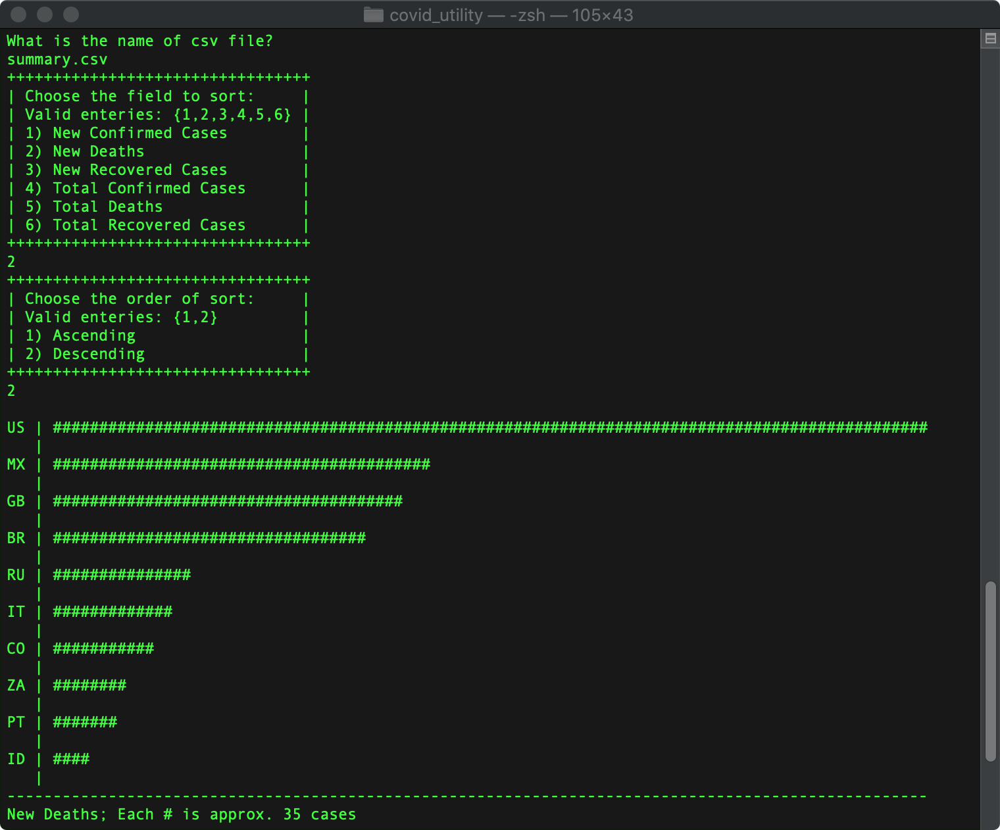

# A Simple COVID-19 Utility
My goal was to develop a simple C++ utility for working with COVID-19 data from [COVID-19 API](https://covid19api.com). This utility will load a CSV file of COVID-19 data from countries around the world, do some sorting of the data and plot some simple terminal-based bar charts of the data.

## Setup
You will need to install `g++`, `jq`, and `curl` (or `wget`) if you do not have them already.

If you use macOS, g++ comes with Xcode command line tools, you can install it by running the following:
```
xcode-select --install
```
If you use brew, simply run:
```
brew install jq
brew install wget
```
## How to compile and run

Download the most up-to-date summary from the API and store it as a JSON file:
```
curl https://api.covid19api.com/summary >> summary.json
```

Convert the JSON file to a CSV file, for easier use:
```
bash json2csv.sh summary.json >> summary.csv
```

Compile the project:
```
make
```

Run:
```
./covid_utility
```

### Snapshot
